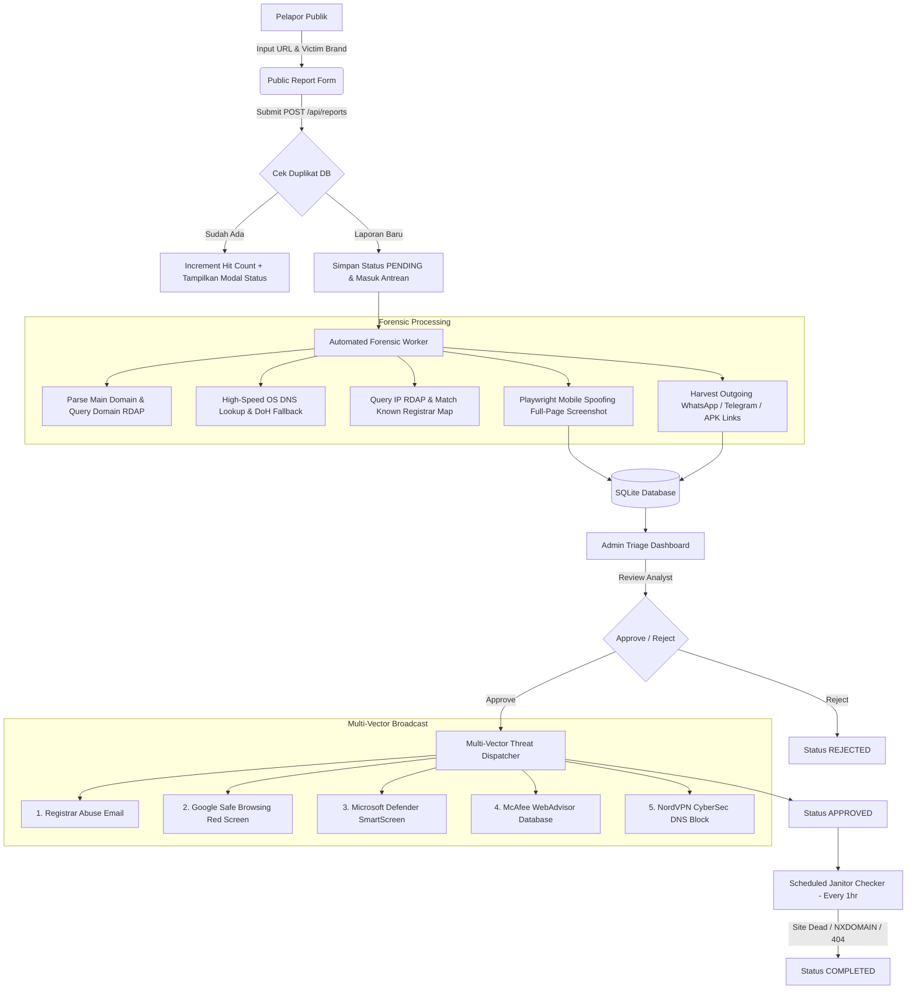

# 🛡️ Phishing Website Reporter & Automated Takedown Hub

A modern, high-performance monorepo platform for local cybersecurity communities, threat analysts, and brand protection teams to report, investigate, capture forensic evidence, and dispatch multi-vector takedown notices for malicious phishing websites.

---

## 📌 Table of Contents
- [Deskripsi (Description)](#-deskripsi-description)
- [Fitur Utama (Key Features)](#-fitur-utama-key-features)
- [Prasyarat (Requirements)](#-prasyarat-requirements)
- [Alur Kerja Sistem (Process & Architecture Workflow)](#-alur-kerja-sistem-process--architecture-workflow)
- [Panduan Instalasi & Penggunaan (Installation & Setup)](#-panduan-instalasi--penggunaan-installation--setup)
- [Dokumentasi API (API Reference)](#-dokumentasi-api-api-reference)
- [Struktur Proyek (Project Structure)](#-struktur-proyek-project-structure)

---

## 📖 Deskripsi (Description)

**Phishing Website Reporter** adalah platform analisis forensik dan pelaporan situs phishing otomatis. Sistem ini mengombinasikan *Playwright mobile headless browser*, resolusi DNS berkecepatan tinggi, pencarian kontak registrar (RDAP), pemindaian vektor ancaman sekunder (WhatsApp/Telegram/APK), serta modul penyiaran laporan ancaman (*Multi-Vector Threat Broadcast*) ke berbagai penyedia keamanan global seperti Google Safe Browsing, Microsoft Defender SmartScreen, McAfee WebAdvisor, dan NordVPN CyberSec.

---

## ✨ Fitur Utama (Key Features)

- **Public Reporting Form:** Form pelaporan publik yang bersih dengan validasi URL, *input field* merek korban (*Victim Brand Name*), serta perlindungan verifikasi Turnstile CAPTCHA.
- **Deduplikasi Otomatis:** Deteksi laporan duplikat secara real-time. Laporan yang pernah dikirim sebelumnya akan meningkatkan jumlah *hit count* (+1) tanpa membebankan worker forensik.
- **Worker Forensik Otomatis:**
  - **Pencarian Domain & IP RDAP:** Identifikasi nama Registrar, penyedia server Hosting, serta email pengaduan penyalahgunaan (*Abuse Contact Email*).
  - **Resolusi DNS Cepat & Fallback:** Resolusi DNS lokal OS (<10ms) dengan *fallback* Cloudflare DNS-over-HTTPS (DoH).
  - **Tangkapan Layar Bukti Forensik:** Pengambilan screenshot halaman penuh (*full-page screenshot*) dengan penyamaran perangkat HP Android/iOS.
  - **Pemindai Link Keluar (*Cross-Domain Harvester*):** Deteksi otomatis tautan penipuan sekunder seperti grup WhatsApp (`wa.me`), bot Telegram (`t.me`), Google Forms, dan file instalasi malware (`.apk`).
- **Konsol Triage Admin 3 Kolom:** Workspace investigasi profesional yang menyajikan antrean prioritas (*hit count DESC*), bukti screenshot di dalam bingkai browser mockup, dan matriks risiko tautan keluar.
- **Multi-Vector Threat Intelligence Broadcast:** Penyiaran otomatis laporan ancaman saat disetujui (*Approved*) ke:
  1. 📧 Email Abuse Registrar & Hosting Provider
  2. 🔴 **Google Safe Browsing** (Memicu layar peringatan merah di Chrome/Firefox/Safari)
  3. 🪟 **Microsoft Defender SmartScreen** (Pemblokiran di MS Edge & Windows Defender)
  4. 🔒 **McAfee WebAdvisor / SiteAdvisor** (Database ancaman domain McAfee)
  5. 🌐 **NordVPN Threat Protection / CyberSec** (Pemblokiran DNS NordVPN)
- **Verifikasi Kematian Situs Otomatis (*Janitor Service*):** Layanan latar belakang berkala yang memeriksa ulang situs approved setiap jam. Jika situs sudah mati (*NXDOMAIN / HTTP 404 / Safe Browsing warning*), status otomatis diubah menjadi `COMPLETED`.

---

## ⚙️ Prasyarat (Requirements)

Sebelum menjalankan aplikasi ini, pastikan sistem Anda memenuhi kebutuhan berikut:

- **Node.js:** v18.x atau versi yang lebih baru (`node -v`)
- **npm:** v9.x atau lebih baru
- **Playwright Chromium:** Browser headless untuk mengambil screenshot forensik
- **Sistem Operasi:** Windows 10/11, macOS, atau Linux

---

## 🔄 Alur Kerja Sistem (Process & Architecture Workflow)



### Penjelasan Tahapan Alur Kerja (*Process Step-by-Step*):
1. **Input & Verification:** Pelapor memasukkan URL mencurigakan dan nama merek korban (*Victim Brand Name*).
2. **Deduplication Check:** Sistem memeriksa database. Jika URL duplikat, hit count bertambah dan modal status langsung diperlihatkan.
3. **Forensic Scanning:** Worker memproses domain, mendapatkan IP, mengekstrak email abuse registrar & hosting, mengambil screenshot tampilan HP, serta memanen link WhatsApp/Telegram/APK.
4. **Admin Triage Review:** Analis keamanan memeriksa seluruh bukti forensik di Admin Console 3 Kolom.
5. **Multi-Channel Dispatch:** Saat disetujui, laporan dikirim secara simultan ke Registrar Abuse Email, Google Safe Browsing, SmartScreen, McAfee, dan NordVPN.
6. **Death Verification:** Janitor Service memantau keberadaan situs hingga mati secara otomatis.

---

## 🚀 Panduan Instalasi & Penggunaan (Installation & Setup)

### 1. Clone Repository
```bash
git clone https://github.com/ekorangin/phising-website-reporter.git
cd phising-website-reporter
```

### 2. Install Dependensi (Monorepo, Server & Client)
```bash
npm run install:all
```

### 3. Install Playwright Chromium Engine
```bash
npx playwright install chromium
```

### 4. Jalankan Aplikasi di Environment Lokal
```bash
npm run dev
```
Perintah di atas akan menjalankan dua server sekaligus:
- **Express Backend API Server:** [http://localhost:5000](http://localhost:5000)
- **Vite React Frontend Dev Server:** [http://localhost:5173](http://localhost:5173)

---

## 📡 Dokumentasi API (API Reference)

| Method | Endpoint | Deskripsi |
| :--- | :--- | :--- |
| `POST` | `/api/reports` | Mengirimkan laporan URL baru (Body: `reported_url`, `target_brand_raw`). |
| `GET` | `/api/reports/status?url=...` | Memeriksa status laporan berdasarkan URL. |
| `GET` | `/api/reports/pending` | Mengambil daftar kasus pending untuk konsol admin. |
| `POST` | `/api/reports/:id/approve` | Menyetujui laporan & menyiarkan ke 5 saluran *Threat Intelligence*. |
| `POST` | `/api/reports/:id/reject` | Menolak laporan ancaman. |
| `DELETE` | `/api/reports/pending` | Menghapus seluruh kasus bermodal *PENDING* dari database. |
| `DELETE` | `/api/reports/:id` | Menghapus spesifik 1 laporan berdasarkan ID. |
| `GET` | `/api/brands?q=...` | Mendapatkan saran nama merek terpopuler. |
| `POST` | `/api/janitor/run` | Memicu pengecekan kematian situs (*Janitor check*) secara manual. |

---

## 📁 Struktur Proyek (Project Structure)

```text
phising-website-reporter/
├── client/                     # Frontend React (Vite)
│   ├── src/
│   │   ├── components/
│   │   │   ├── AdminDashboard.jsx  # Konsol Triage Admin 3 Kolom
│   │   │   ├── PublicForm.jsx      # Form Pelaporan Publik
│   │   │   └── StatusModal.jsx     # Overlay Status Deduplikasi
│   │   ├── App.jsx             # Shell Navigasi Utama
│   │   └── index.css           # Styling Vanilla CSS UI
│   └── package.json
├── server/                     # Backend Express.js Server
│   ├── src/
│   │   ├── index.js            # Server API Entrypoint & Routes
│   │   ├── worker.js           # Worker Forensik & Tangkapan Layar (Playwright)
│   │   ├── threat_dispatcher.js# Modul Multi-Vector Threat Intelligence Broadcast
│   │   ├── mailer.js           # Pengirim Email Abuse Registrar
│   │   ├── janitor.js          # Scheduler Verifikasi Kematian Situs
│   │   └── db.js               # Inisialisasi SQLite Database
│   ├── public/screenshots/     # Direktori Penyimpanan Screenshot Forensik (.jpg)
│   └── package.json
├── README.md                   # Dokumentasi Proyek
└── package.json                # Root Monorepo Scripts
```

---

## 📄 Lisensi (License)

Diterbitkan di bawah [MIT License](LICENSE). Proyek terbuka untuk komunitas keamanan siber lokal.
