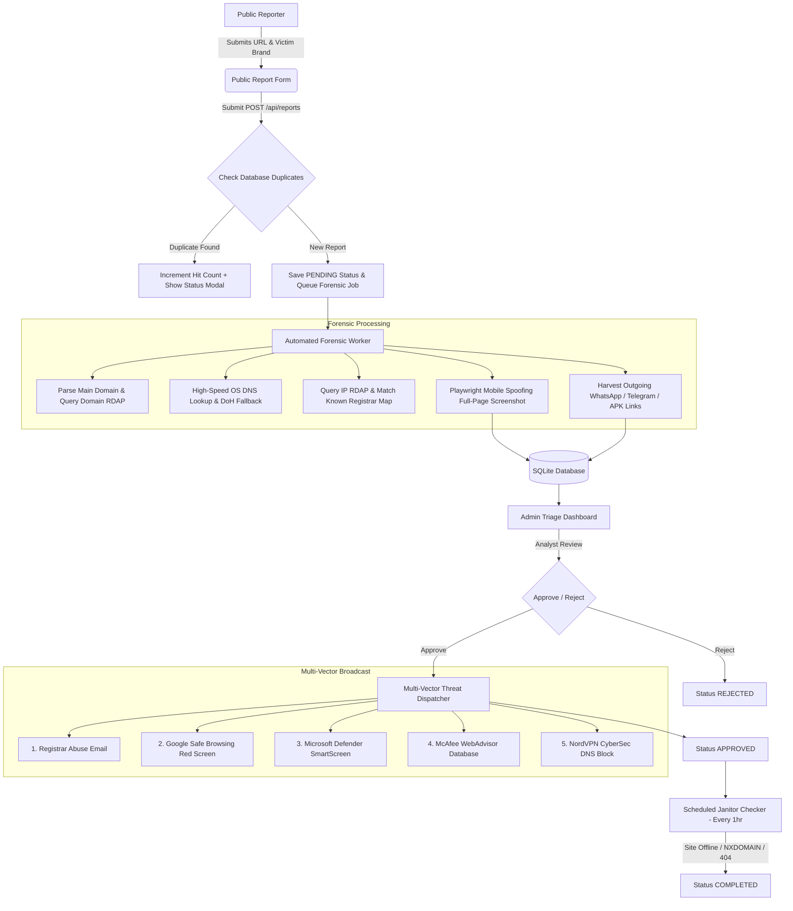

# 🛡️ Phishing Website Reporter & Automated Takedown Hub

A modern, high-performance monorepo platform designed for cybersecurity communities, threat intelligence analysts, and brand protection teams to report, investigate, capture forensic evidence, and dispatch multi-vector takedown notices for malicious phishing websites.

---

## 📌 Table of Contents
- [Overview & Description](#-overview--description)
- [Key Features](#-key-features)
- [System Requirements](#-system-requirements)
- [Process & Architecture Workflow](#-process--architecture-workflow)
- [Installation & Setup Guide](#-installation--setup-guide)
- [API Reference](#-api-reference)
- [Project Structure](#-project-structure)
- [License](#-license)

---

## 📖 Overview & Description

**Phishing Website Reporter** is an automated phishing site investigation and takedown platform. It combines Playwright mobile headless browser automation, ultra-fast DNS resolution, domain registrar RDAP lookup, outgoing secondary threat link harvesting (WhatsApp, Telegram, Google Forms, APK malware), and a multi-vector threat broadcast module to report phishing URLs across major global threat intelligence providers (Google Safe Browsing, Microsoft Defender SmartScreen, McAfee WebAdvisor, and NordVPN CyberSec).

---

## ✨ Key Features

- **Clean Public Reporting Interface:** Sleek, centered form layout with URL validation, Victim Brand Name input, and Turnstile CAPTCHA verification.
- **Real-Time Deduplication Layer:** Automatically detects repeat reports for the same URL, incrementing the threat hit count (+1) and displaying current status without re-triggering heavy worker tasks.
- **Automated Forensic Processing Worker:**
  - **Domain & IP RDAP Lookup:** Automatically identifies domain registrar details, hosting infrastructure owners, and official abuse contact email addresses (`abuse@...`).
  - **Ultra-Fast DNS Resolution:** Employs local OS DNS lookup (<10ms) with automatic fallback to Cloudflare DNS-over-HTTPS (DoH).
  - **Full-Page Forensic Screenshots:** Captures full-page mobile-spoofed screenshots (Android/iOS User-Agent & viewport) using Playwright headless browser.
  - **Cross-Domain Link Harvester:** Scans target pages for outgoing secondary scam channels (WhatsApp `wa.me`, Telegram `t.me`, Google Forms, and `.apk` malware download URLs).
- **3-Column Admin Triage Dashboard:** Professional triage workspace featuring priority queue sorted by `hit_count DESC`, technical forensic spec cards, browser mockup frame screenshot viewer, and grouped outgoing link risk matrix.
- **Multi-Vector Threat Intelligence Broadcast:** Automatically dispatches threat notifications upon approval across 5 security channels:
  1. 📧 **Registrar & Hosting Provider Abuse Email**
  2. 🔴 **Google Safe Browsing API** (Triggers Red Interstitial Warning Page in Chrome, Firefox & Safari)
  3. 🪟 **Microsoft Defender SmartScreen** (Triggers blocklist protection in Edge & Windows Defender)
  4. 🔒 **McAfee WebAdvisor / SiteAdvisor** (Adds URL to McAfee Malicious Site Database)
  5. 🌐 **NordVPN Threat Protection / CyberSec** (Blocks DNS resolution for Nord Security users)
- **Automated Janitor Death Verification:** Background scheduler (runs hourly) that periodically verifies availability of approved threat URLs. When a site goes offline (*NXDOMAIN / HTTP 404 / Safe Browsing warning*), the status is automatically set to `COMPLETED`.

---

## ⚙️ System Requirements

Ensure your environment satisfies the following prerequisites before running the application:

- **Node.js:** v18.x or higher (`node -v`)
- **npm:** v9.x or higher
- **Playwright Chromium:** Headless browser engine for capturing forensic screenshots
- **Operating System:** Windows 10/11, macOS, or Linux

---

## 🔄 Process & Architecture Workflow



### Process Step-by-Step:
1. **Report Submission:** The user submits a suspicious URL and the Victim Brand Name.
2. **Deduplication Check:** The system queries the database. If duplicate, hit count increments and the real-time status overlay opens.
3. **Forensic Scanning:** The worker resolves domain info, IP address, registrar abuse emails, captures mobile screenshots, and harvests outgoing scam links.
4. **Admin Triage Review:** Security analysts review forensic evidence inside the 3-Column Admin Dashboard.
5. **Multi-Channel Dispatch:** Upon approval, threat reports are broadcast simultaneously to Registrar Abuse Email, Google Safe Browsing, Microsoft SmartScreen, McAfee, and NordVPN.
6. **Death Verification:** The Janitor Service monitors site status hourly until taken down automatically.

---

## 🚀 Installation & Setup Guide

### 1. Clone Repository
```bash
git clone https://github.com/ekorangin/phising-website-reporter.git
cd phising-website-reporter
```

### 2. Install Monorepo Dependencies
```bash
npm run install:all
```

### 3. Install Playwright Chromium Engine
```bash
npx playwright install chromium
```

### 4. Run Development Server
```bash
npm run dev
```
This command starts both servers concurrently:
- **Express Backend API Server:** [http://localhost:5000](http://localhost:5000)
- **Vite React Frontend UI:** [http://localhost:5173](http://localhost:5173)

---

## 📡 API Reference

| Method | Endpoint | Description |
| :--- | :--- | :--- |
| `POST` | `/api/reports` | Submit a new suspicious URL report (`reported_url`, `target_brand_raw`). |
| `GET` | `/api/reports/status?url=...` | Check report status by URL. |
| `GET` | `/api/reports/pending` | Retrieve all pending triage cases for the admin console. |
| `POST` | `/api/reports/:id/approve` | Approve report & broadcast across 5 threat intelligence channels. |
| `POST` | `/api/reports/:id/reject` | Reject report. |
| `DELETE` | `/api/reports/pending` | Delete all pending cases from the database. |
| `DELETE` | `/api/reports/:id` | Delete a specific report by ID. |
| `GET` | `/api/brands?q=...` | Retrieve brand suggestions autocomplete. |
| `POST` | `/api/janitor/run` | Manually trigger site availability verification check. |

---

## 📁 Project Structure

```text
phising-website-reporter/
├── client/                     # React Frontend (Vite)
│   ├── src/
│   │   ├── components/
│   │   │   ├── AdminDashboard.jsx  # 3-Column Admin Triage Console
│   │   │   ├── PublicForm.jsx      # Public Reporting Form Component
│   │   │   └── StatusModal.jsx     # Deduplication Status Modal
│   │   ├── App.jsx             # Main Navigation & View Switcher
│   │   └── index.css           # Vanilla CSS Styling & Design Tokens
│   └── package.json
├── server/                     # Express.js Backend & Workers
│   ├── src/
│   │   ├── index.js            # Express API Server Entrypoint & Routes
│   │   ├── worker.js           # Playwright Forensic & Screenshot Worker
│   │   ├── threat_dispatcher.js# Multi-Vector Threat Intelligence Dispatcher
│   │   ├── mailer.js           # Registrar Abuse Email Generator
│   │   ├── janitor.js          # Scheduled Site Death Checker
│   │   └── db.js               # SQLite Database Initialization
│   ├── public/screenshots/     # Captured Forensic Screenshot Directory (.jpg)
│   └── package.json
├── README.md                   # Project Documentation
└── package.json                # Root Monorepo Scripts
```

---

## 📄 License

This project is licensed under the [MIT License](LICENSE). Open for community cybersecurity & threat intelligence collaboration.
